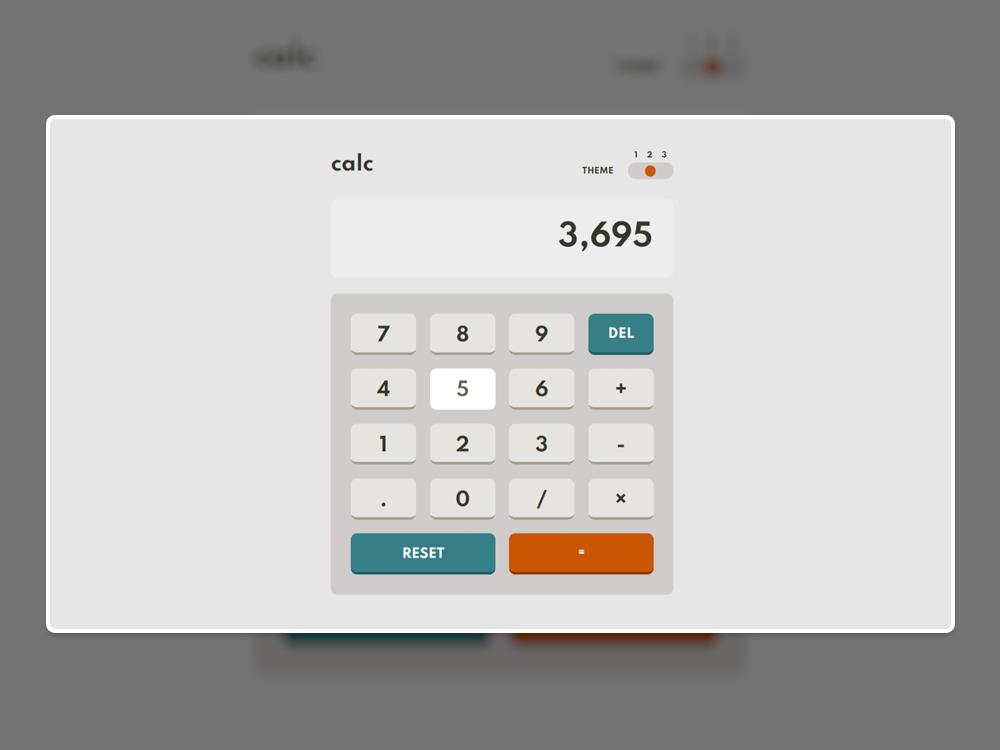

# Calculator-JavaScript-App

Responsive javascript Calculator with a basic layout allows users to toggle between 3 themes and save their theme preference in the browser.

## [Live Demo](https://thanasak-calculator.netlify.app/)

## Stack
- [JavaScript](https://www.javascript.com/) - The programming language for the Web.
- [CSS](https://www.w3schools.com/css/) - A language used to style an HTML document.
- [HTML](https://www.w3schools.com/html/) - The standard markup language for Web pages.

## Design 

 
